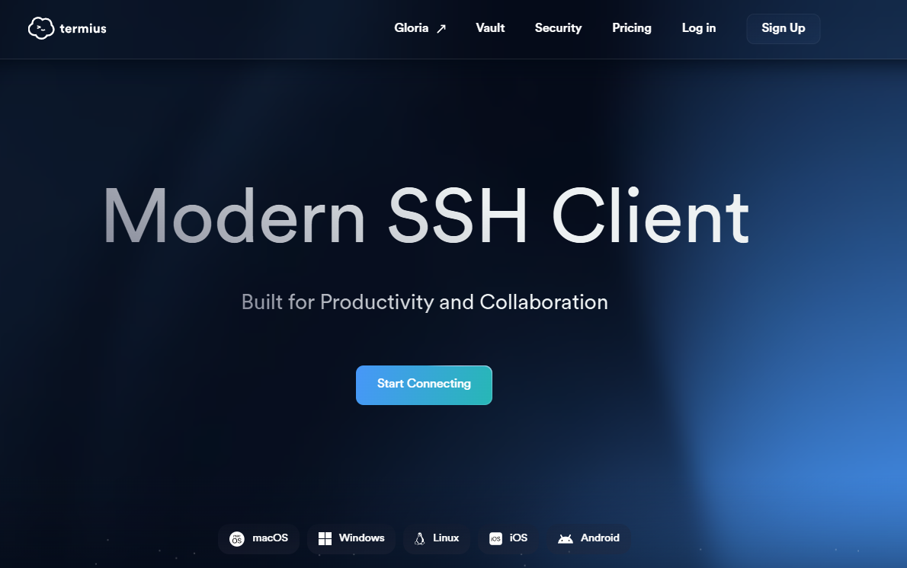
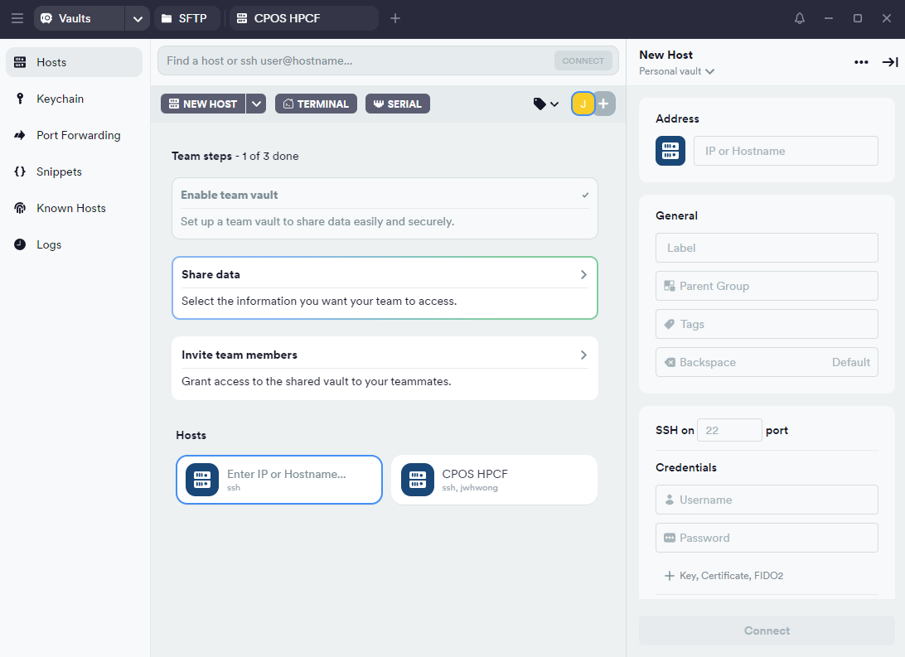
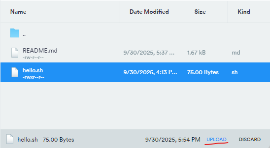

# README

## Instructions for making pull request

This README provides step-by-step instructions for making your first pull request on the CPOS server

### Step 1. Installing Termius

We recommend installing Termius ([https://termius.com](https://termius.com/index.html)). It is a cross-platform SSH client that provides a terminal and also easy access to your files on the server via SFTP.

{width="560"}

Create a new account, sign in, and install. Open the tool and enter the relevant CPOS server details on the **Host** page under **Vaults** tab.

{width="563"}

Once you connect, you will see a Terminal . You can also go to the SFTP tab and on the right pane, connect to the server as well.

**IMPORTANT:** You can open the files on the CPOS server directly on the right pane and edit them in your favourite IDE (e.g. VSCode), but after editing, remember to click Upload on the bottom right.

### {width="426"}

### Step 2. Setting up CPOS server to use Github

To enable logging into your Github from the CPOS server, you have to generate a **Personal Access Token (PAT)**.

-   Go to your GitHub account in a web browser.

-   Click your profile picture \> **Settings** \> **Developer settings** \> **Personal access tokens**.

-   Click **Generate new token** (choose classic).

-   Select the scopes you need (for most assignments, **`repo`** is enough).

-   Copy the token **now** and save it somewhere — you won’t see it again!

Furthermore, on the CPOS server itself, you also have to configure your name and email. In the terminal type the following:

``` bash
git config --global user.name "<your name>"
git config --global user.email "<your email>"
```

### Step 2. Clone the Repository

Now you are ready to clone Git respositories onto your account on the CPOS server.

On the GitHub webpage, navigate to the main page of the repository (i.e this repository) you want to clone.

Click the Code button and copy the repository URL (choose HTTPS or SSH as appropriate).

Open your terminal and navigate to the directory where you want the repo to be cloned.

Run:

``` bash
git clone <repository-url> 
```

For example:

``` bash
git clone https://github.com/HKU-BIOF3002/demo-jwon7011.git
```

This creates a new folder with the repository contents.

## Step 3. Create and Switch to a New Branch

1.  Change into the repository directory:

    ``` bash
    cd <YOUR-REPOSITORY>
    ```

2.  Create and switch to a new branch (replace **`my-branch`** with your branch name):

    ``` bash
    git checkout -b my-branch
    ```

    This both creates and checks out the new branch.

## Step 4. Make Your Changes

-   Edit, add, or delete files as needed for your assignment.

-   In the case of this demo assignment, you want to edit your **`hello.sh`** bash script such that it would read a name directly as a command-line argument and then print "My name is \<name from command line\>". For example if you execute:

    ``` bash
    ./hello.sh John
    ```

    It will print "My name is John"

-   In the case of an executable script like **`hello.sh`** make sure to make it executable.

    ``` bash
    chmod 755 hello.sh
    ```

## Step 5. Stage and Commit Your Changes

1.  Stage your changes:

    ``` bash
    git add .
    ```

    (Or specify files instead of **`.`** if you want to add only certain files.)

2.  Commit your changes with a message:

    ``` bash
    git commit -m "Describe your changes here" 
    ```

## Step 6. Push Your Branch to GitHub

-   Push your new branch to the remote repository:

    ``` bash
    git push origin my-branch
    ```

## Step 7. Create a Pull Request

1.  Go to your repository page on GitHub in your web browser.

2.  GitHub will often show a banner to "Compare & pull request" for your new branch. Click it.

3.  If not, go to the **Pull requests** tab and click **New pull request**.

4.  Select your branch as the compare branch, and the main branch (often **`main`** or **`master`**) as the base.

5.  Fill in the title and description, then click **Create pull request**.

## Step 8. Updating code and assignment submission

After the pull request has been completed. If you want to make changes to your code, just repeat Step 5 - 6 to commit and push changes to the GitHub repository.

When you are ready to submit the assignment, you need to commit and push the code from the main branch. To do so:

1.  Switch to **`main`**:

    ``` bash
    git checkout main
    ```

2.  Merge your branch (replace **`my-branch`** with the name of your branch):

    ``` bash
    git merge my-branch
    ```

3.  Stage and commit your work on **`main`**:

    ``` bash
    git add.
    git commit -m "Final submission"
    ```

4.  Push the updated main to GitHub:

    ``` bash
    git push origin main
    ```
